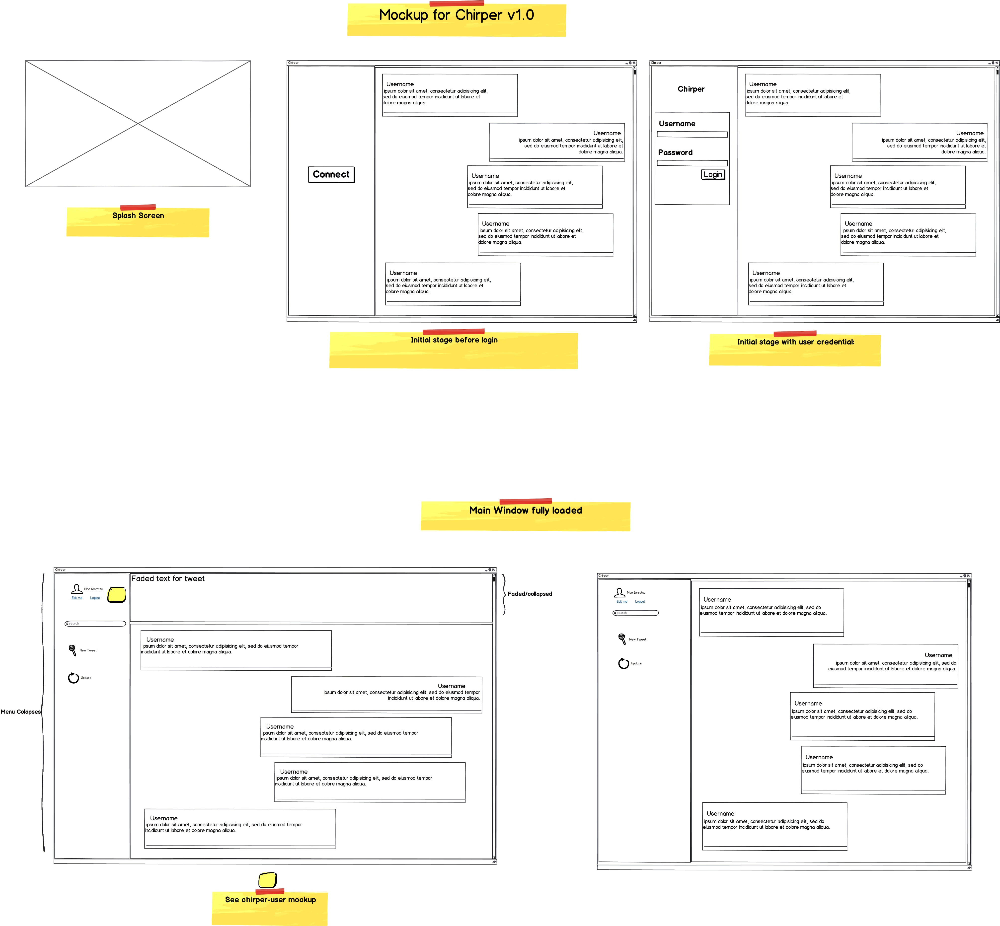
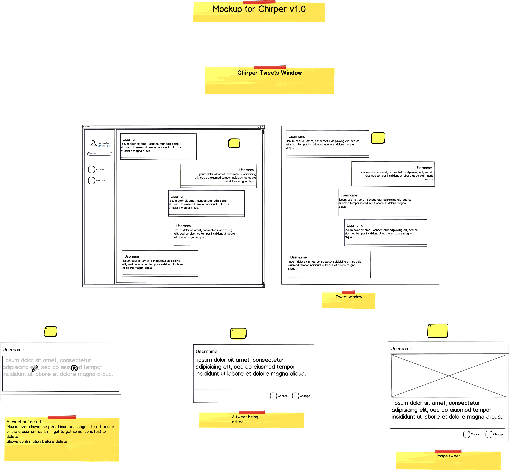
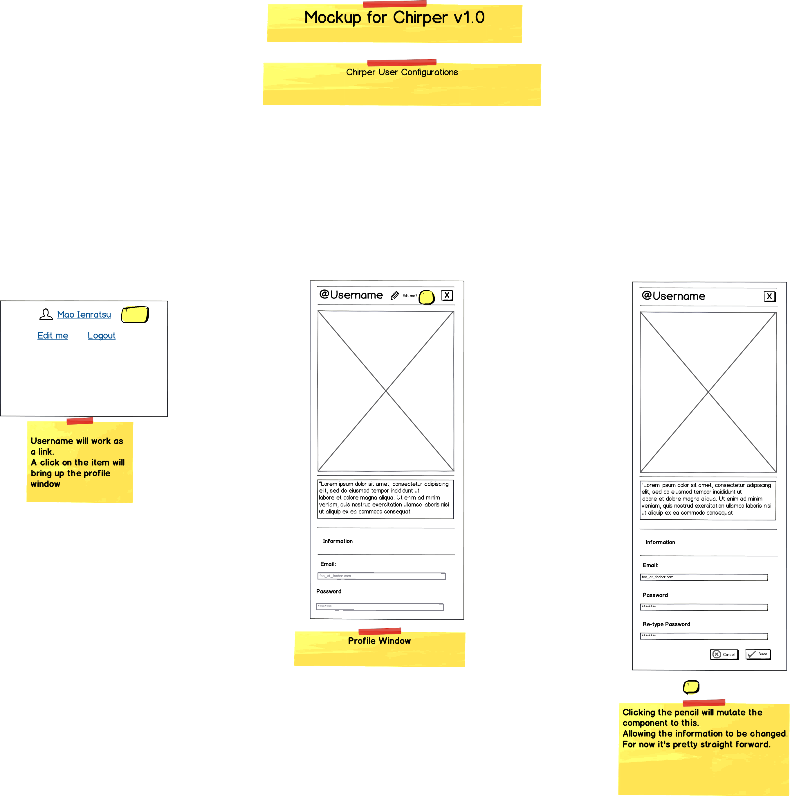

# Chirper Client


This repository contains the implementation of the client side of the project.


# Methodology used
Instead of creating a single repo for each challenge and as i'm familiar with github it condensed the api challenges in one package/repo.
As it's not in direct contradiction of the rules and/or objective.
In terms of development methodology i used the following:
  - /app/
    - this folder contains the implementation part of the client
  - /app/components/
    - this folder contains all the view implementation and also the logic used. 
  - /app/Assets/
    - Inside this folder are the shiny shiny bits of the project
  - /app/services
    - this folder contains the service logic used to glue it all together between the frontend and the backend
  - /app/mockups
    - conceptual vision of the ui to be implemented on the app


### Conceptual Design of the UI
Bellow are the ui conceptual design for this early version.
As the project evolves so will the mockups added in here.<br  />
The images bellow are rescaled, for a full size check inside the appropriate folder (mockups)
The early version of the main window
<!--  -->
<br  />
Early conceptual vision of chirps<br  />
<!--  -->
<br  />
Early conceptual vision about the user information<br  />
<br  />
<!---->

### Tech

this set of challenges uses a number of open source projects to work properly:
* [Electron] - Is an open-source framework developed by GitHub.It allows for the development of desktop GUI applications using the Node.js runtime
* [node.js] - evented I/O for the backend
* [Angular] - Great Javascript based framework for implementing either MVC or MVVM architectures.
* [Angular-Material]- AngularJS Material is both a UI Component framework and a reference implementation of Google's Material Design Specification.


And of course the implementation of the challenges themselves are open source with a [git-repo-url]
 on GitHub.

### Installation from source

freecodecamp api  requires [Node.js](https://nodejs.org/) v4+ to run.

Download and extract the [latest pre-built release](https://github.com/jonniebigodes/chirper/releases).

Install the dependencies and devDependencies and start the server.

```sh
$ cd folder to contain the app
$ npm install 
$ npm start

Open url http://localhost:5000
```


License
----

MIT


**Free Software, Hell Yeah!**

[//]: # (These are reference links used in the body of this note and get stripped out when the markdown processor does its job. There is no need to format nicely because it shouldn't be seen. Thanks SO - http://stackoverflow.com/questions/4823468/store-comments-in-markdown-syntax)


   
   [git-repo-url]: <https://github.com/jonniebigodes/chirper.git>
   [node.js]: <http://nodejs.org>
   [Electron]: <https://electron.atom.io/>
   [PlGh]:  <https://github.com/jonniebigodes/https://github.com/jonniebigodes/chirper/tree/master/chirper-client/tree/master/plugins/github/readme.md>
   [Angular]: <https://angularjs.org/>
   [Angular-Material]:<https://material.angularjs.org/latest/>