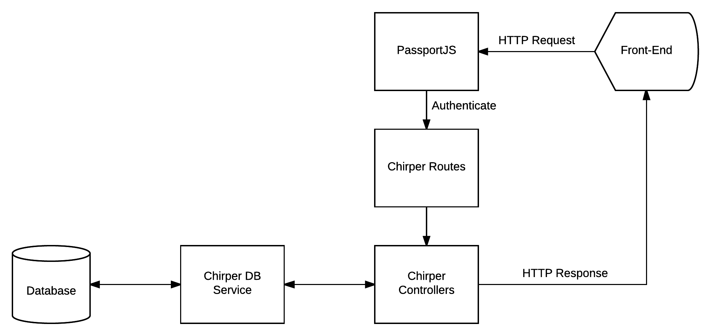

# Chirper's Architecture

### Changelog:
- [25/07/2017] First version.

## Tech Stack

Chiper's back-end is developed using a [MEAN](https://en.wikipedia.org/wiki/MEAN_(software_bundle)) stack, with the following components:

- **MongoDB**
- **Express JS**
- **AngularJS** (with Angular Material)
- **NodeJS**

For the authentication, we're using **PassportJS** and, if needed, we'll also use **Mongoose** to model and validate the database objects.

## Architecture Diagram



## Requirements

The back-end server should:

- be stateless;
- be asynchronous;
- only accept requests if the user is authenticated;
- connect to the database;
- manage the collections in the database;
- add data to the database;
- update data in the database;
- remove data from the database;
- search for data in the database;
- pre-process data returned from the database, if needed;
- redirect requests to the correct functions.

## Database Models

### User Data Model
```javascript
{
    username: String,
    name: String, // display name
    email: String,
    dateOfBirth: Date,
    picture: String, // url
    location: String, // optional
    country: String,
    online:{ // optional
        webpage: String,
        facebook: String,
        twitter: String,
        instagram: String,
        github: String
    },
    following: {
        number: Integer,
        userIds: [ObjectId] // store the Ids of the users followed
    }
    followers: {
        number: Integer,
        userIds: [ObjectId] // store the Ids of the users that follow this account
    }
}
```

### Settings Data Model
```javascript
{
    userId: ObjectId, // should match the one in mongodb's user collection
    theme: String, // light, dark, etc
    displayLocation: Boolean,
    displayName: Boolean,
    secretAccount: Boolean, // secret accounts do not display chirps and do not show up in searches
    language: String,
    timezone: String,
    dateFormat: String
}
```

### Posts Data Model
```javascript
{
    userId: ObjectId, // should match the one in mongodb's user collection
    likes: {
        number: Integer,
        userIds: [ObjectId] // the Ids of the users that liked this post
    },
    replies: {
        number: Integer,
        replyIds: [ObjectId] // the Ids of the reply posts
    },
    timestamp: Timestamp,
    location: String // optional
    text: String,
    edited: Boolean,
    archived: Boolean, // if archived, the post and its replies shouldn't be displayed in the user's profile
    pinned: Boolean // if pinned, the post should show up at the top of the user's profile
    tags: [String]
}
```